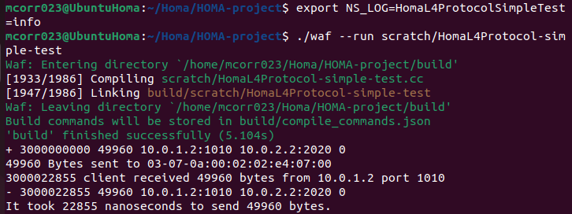

Maria Correa Update 4/4/2023:

Updated HomaL4Protocol-simple-test.cc to parse a variable size of the message.
Updated HomaL4Protocol-simple-test.cc to calculate the time in nanoseconds it takes to send message.

How to run:
1) git clone https://github.com/mcorr23/HomaCIS4911.git
2) ./waf configure
3) ./waf 
4) Change the size of the message to your liking: line 220 variable name "messageSize" (It accounts for Serialized Size of Homa and ipv4h) 
5) export NS_LOG=HomaL4ProtocolSimpleTest=info
5) ./waf --run scratch/HomaL4Protocol-simple-test



Wenjia Update 2/28/2023

How to run this project:

0) build your own DIRECTORY in your own linux: "mkdir workplace4HOMA", then "cd workplace4HOMA" & git clone there.

(if you haven't build ur own linux, check this: https://medium.com/tech-lounge/how-to-install-ubuntu-on-mac-using-virtualbox-3a26515aa869)


1) git clone https://github.com/HOMA-Repo/HOMA-project.git
3) ./waf configure
4) ./waf 


(you should be ablt to see this after building using (./waf):


how to test HOMA protocol: 
./waf --run scratch/HomaL4Protocol-simple-test


tips: use <h3> ./waf clean </h3> if you met any errors, it should help fix it.

(the executions of these commands could be long. some of them took me more than 40 minutes, please keep your machine running during executing)

This project is a combination of ns-3 and HOMA protocol (applied HOMA on ns-3).

ns-3-dev source code: https://gitlab.com/nsnam/ns-3-dev

source code of this demo: https://github.com/serhatarslan-hub/HomaL4Protocol-ns-3


================================

Homa Transport Protocol on The Network Simulator, Version 3
================================

Maintained by [Serhat Arslan](https://web.stanford.edu/~sarslan/)

This  is  an  implementation of the Homa Transport Protocol described in \[1\].
It implements a connectionless, reliable, low latency message delivery service. 

\[1\] Behnam Montazeri, Yilong Li, Mohammad Alizadeh, and John Ousterhout. 2018. 
Homa: a receiver-driven low-latency transport protocol using network 
priorities. In <i>Proceedings of the 2018 Conference of the ACM Special Interest 
Group on Data Communication</i> (<i>SIGCOMM '18</i>). Association for Computing 
Machinery, New York, NY, USA, 221–235. 
DOI:https://doi-org.stanford.idm.oclc.org/10.1145/3230543.3230564

This implementation is created after a series of meetings with the protocol creators and maintained as an ns-3 implementation of the protocol. 
It has not yet undergone extensive validation by the Homa creators and there are couple of missing features which are listed in the "Issues" tab of this repository. 
Hence, bugs or performance issues may exist. 
If you encounter any, please reach out to us. 

If you decide to use this artifact on your work, please cite it as the following:

@misc{arslan, 
  author = {Arslan, Serhat},
  title  = {An NS-3 Implementation of Homa Transport Protocol}, 
  url    = {https://github.com/serhatarslan-hub/HomaL4Protocol-ns-3}, 
  year   = {2021}, 
  month  = {Mar}
} 

The most complete version of the protocol can be found at [this repository](https://github.com/PlatformLab/HomaModule) which implements Homa as a Linux Kernel Module.

## Table of Contents:

1) [An overview](#an-open-source-project)
2) [Building ns-3](#building-ns-3)
3) [Running ns-3 with a simple HomaL4Protocol test](#running-ns-3-with-a-simple-homal4protocol-test)
4) [Getting access to the ns-3 documentation](#getting-access-to-the-ns-3-documentation)
5) [Working with the development version of ns-3](#working-with-the-development-version-of-ns-3)
6) [List of related files for HomaL4Protocol based on NS3](#list-of-related-files-for-homal4protocol-based-on-ns3)

Note:  Much more substantial information about ns-3 can be found at
https://www.nsnam.org

## An Open Source project

ns-3 is a free open source project aiming to build a discrete-event
network simulator targeted for simulation research and education.
This is a collaborative project; we hope that
the missing pieces of the models we have not yet implemented
will be contributed by the community in an open collaboration
process.

The process of contributing to the ns-3 project varies with
the people involved, the amount of time they can invest
and the type of model they want to work on, but the current
process that the project tries to follow is described here:
https://www.nsnam.org/developers/contributing-code/

This README excerpts some details from a more extensive
tutorial that is maintained at:
https://www.nsnam.org/documentation/latest/

## Building ns-3

The code for the framework and the default models provided
by ns-3 is built as a set of libraries. User simulations
are expected to be written as simple programs that make
use of these ns-3 libraries.

To build the set of default libraries, you need to use the
tool 'waf'. Detailed information on how to use waf is
included in the file doc/build.txt

However, the real quick and dirty way to get started is to
type the command
```shell
./waf configure
```

followed by

```shell
./waf
```

in the directory which contains this README file. The files
built will be copied in the build/ directory.

The current codebase is expected to build and run on the
set of platforms listed in the [release notes](RELEASE_NOTES)
file.

Other platforms may or may not work: we welcome patches to
improve the portability of the code to these other platforms.

## Running ns-3 with a simple HomaL4Protocol test

On recent Linux systems, once you have built ns-3, it should be 
easy to run the sample programs with the following command, such as:

```shell
./waf --run scratch/HomaL4Protocol-simple-test
```

That program should generate a `HomaL4ProtocolSimpleTestMsgTraces.tr` text
trace file which includes logs related to creation and delivery of messages.
The program source can be found in the scratch/HomaL4Protocol-simple-test.cc.

## Getting access to the ns-3 documentation

Once you have verified that your build of ns-3 works by running
the `HomaL4Protocol-simple-test` as outlined in (3) above, it is
quite likely that you will want to get started on reading
some ns-3 documentation.

All of that documentation should always be available from
the ns-3 website: https://www.nsnam.org/documentation/.

This documentation includes:

  - a tutorial

  - a reference manual

  - models in the ns-3 model library

  - a wiki for user-contributed tips: https://www.nsnam.org/wiki/

  - API documentation generated using doxygen: this is
    a reference manual, most likely not very well suited
    as introductory text:
    https://www.nsnam.org/doxygen/index.html

## Working with the development version of ns-3

If you want to download and use the development version of ns-3, you
need to use the tool `git`. A quick and dirty cheat sheet is included
in the manual, but reading through the git
tutorials found in the Internet is usually a good idea if you are not
familiar with it.

If you have successfully installed git, you can get
a copy of the development version with the following command:
```shell
git clone https://github.com/serhatarslan-hub/HomaL4Protocol-ns-3.git
```

However, we recommend to follow the GitHub guidelines for starters,
that includes creating a GitHub account, forking the ns-3-dev project
under the new account's name, and then cloning the forked repository.
You can find more information in the [manual](https://www.nsnam.org/docs/manual/html/working-with-git.html).

## List of related files for HomaL4Protocol based on NS3

### Created files

`scratch/homa-official-simple-test.cc` : A simple test simulation to verify the Homa Protocol works.

`scratch/homa-paper-reproduction.cc` : The large scale simulation to reproduce the scenario described in the paper.

`src/applications/model/msg-generator-app.cc/h` : The application environment to create given workloads.

`src/internet/model/homa-header.cc/h`: The packet header declaration for HomaL4Protocol.

`src/internet/model/homa-l4-protocol.cc/h`: The main protocol file to define the Homa behavior.

`src/internet/model/homa-socket-factory.cc/h`: Class that creates Homa sockets.

`src/internet/model/homa-socket.cc/h` : Homa socket declaration (very similar to UDP sockets)

`src/traffic-control/model/pfifo-homa-queue-disc.cc/h` : Priority queueing on switches based on packet priorities defined by HomaL4Protocol.

### Modified Files

`src/internet/helper/internet-stack-helper.cc` : HomaL4Protocol is added as a part of default InternetStack.

`src/internet/model/ipv4-global-routing.cc` : ECMP options added in addition to random, ie per-flow.

`src/internet/model/ipv4-l3-protocol.cc/h` : IP fragmentation made configurable. 

`src/point-to-point/model/point-to-point-net-device.cc/h` : Added an API to get the line rate of the device.
